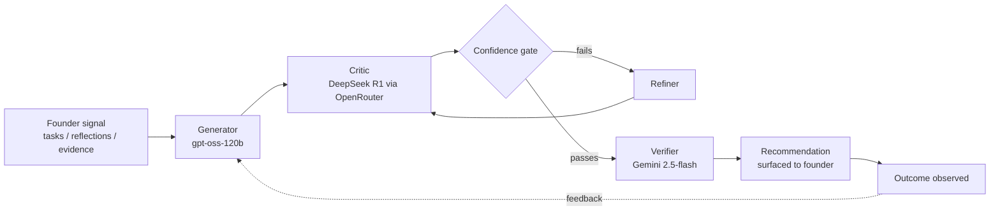

# BuildMind

**AI-powered startup execution intelligence.** BuildMind turns a founder's raw progress signals — completed tasks, written reflections, stage evidence — into a daily, personalized next action, backed by a multi-agent reasoning pipeline rather than a single LLM call.

Live: [buildmind.live](https://buildmind.live)

---

## The problem

Most "AI founder assistant" products are a chat wrapper around one model call: ask a question, get a generic answer. That doesn't hold up under adversarial founder behavior — vague self-reports, inflated self-assessment, or simply not knowing what stage they're actually at. BuildMind is built around the idea that a single model's first output is not trustworthy enough to act on; it needs to be checked before it's shown to a founder as a recommendation.

## Architecture: the Reflexion Loop

Every recommendation BuildMind produces passes through a four-stage pipeline before it reaches a user:

- **Generator** proposes a candidate recommendation from the founder's current stage, momentum, and evidence state.
- **Critic** is a deliberately adversarial second model — different provider, different weights — whose job is to find reasons the Generator's output is wrong, generic, or unsupported before it ever reaches a user.
- **Confidence gate** routes low-confidence output back through a **Refiner** rather than shipping it.
- **Verifier** is a final independent pass before the recommendation is persisted and shown.
- Every recommendation gets a durable ID and is later resolved against what the founder actually did — the loop closes on real outcomes, not just generation quality.

This is the core differentiator: behavioral memory plus an adversarial critic step, not a nicer prompt.

## Beyond generation: a typed state machine, not a chat log

A recommendation engine is only as good as the state it reasons over. BuildMind enforces a small number of invariants strictly, in both TypeScript and DB constraints, so the system can't silently disagree with itself:

- **Stage progress** is computed in exactly one place and consumed by every caller that needs it — no duplicate logic recomputing "what stage is this founder at" differently in different views.
- **Stage transitions** require a 3-signal check (milestone completion, reflection-confidence trend, override count) and a closed 4-type evidence model (metric / artifact / experiment / founder judgment) before a founder is allowed to advance — advancing stage isn't just "mark task done."
- **Composite readiness** merges milestone completion, evidence capture, and reflection trend into a 3-tier signal (`not_ready` / `checklist_only` / `ready`) instead of a binary, so "you finished the checklist but your evidence is thin" is a state the system can actually express, not silence or a false green light.
- **Momentum writes** go through a single atomic RPC — never an ad hoc update — to avoid race conditions across concurrent founder actions.

## Stack

- **Frontend/App:** Next.js
- **Data:** Supabase (Postgres, RLS, RPC functions for atomic state writes)
- **Models:** `openai/gpt-oss-120b` (Generator), DeepSeek R1 via OpenRouter (Critic), Gemini 2.5-flash (Verifier)
- **Payments:** Paystack (built from Ghana, serving a global founder base)

## Engineering process

This is a solo-built system (~154 API routes, ~66 pages, ~136 lib modules) developed iteratively across eight major versions, with AI-assisted implementation used deliberately the way boilerplate-generation tools are used in any modern engineering org: to compress implementation time so more of my own time goes to architecture, invariants, and failure-mode analysis. The project maintains a living internal documentation set — architecture, domain systems, a core-invariants doc, a known-issues log, and a recommended SDLC process — specifically to stop a recurring class of bug (duplicate systems computing the same fact differently) that shows up in fast-iterating solo projects.

## Status

Actively developed. Core stage/evidence/momentum/recommendation systems are deep-verified; some subsystems (founder-modeling layer, curriculum system) are still mid-verification. An honest known-issues log is maintained rather than hidden.

## Author

Built and maintained solo by Emmanuel Bempong 
